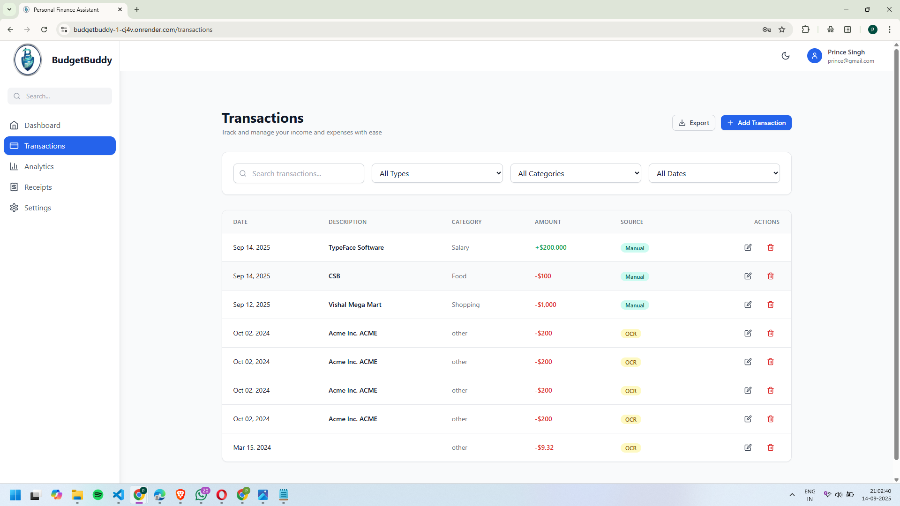

# Personal Finance Assistant - Frontend

[](https://reactjs.org/)
[](https://tailwindcss.com/)
[](https://vitejs.dev/)

A modern, responsive React frontend application for managing personal finances with dark/light mode support, built with React, Tailwind CSS, and modern development tools.

## ✨ Demo

[Live Demo](https://budgetbuddy-1-cj4v.onrender.com)

---

## 📸 Screenshots

### Login View


### Register View


### Dashboard View


### Transaction View



### Analytics View


### Receipt View


### Settings View


### Mobile View (Dark Mode)


### Database Schema


### Receipt OCR Workflow


---

## 🚀 Features

### 🔐 Authentication

* User registration and login
* JWT token-based authentication
* Password reset functionality
* Secure session management

### 📊 Dashboard

* Financial overview with summary cards
* Interactive charts (Income vs Expenses)
* Recent transactions display
* Expense category breakdown
* Responsive design for all devices

### 💰 Transaction Management

* Add, edit, and delete transactions
* Filter by date, category, type
* Search functionality
* Bulk operations support
* Real-time updates

### 📈 Analytics

* Detailed spending insights
* Category-wise expense analysis
* Income vs expense trends
* Top merchants analysis
* Interactive charts and graphs
* Export capabilities

### 🧾 Receipt Management

* Upload receipt images and PDFs
* OCR processing for automatic data extraction
* Receipt status tracking
* Error handling for failed processing

### ⚙️ Settings

* Profile management
* Security settings (password change)
* Preferences (currency, date format)
* Notification settings
* Dark/light mode toggle
* Data export and account deletion

### 🎨 UI/UX Features

* Modern, clean design
* Dark and light mode support
* Fully responsive layout
* Loading states and animations
* Error handling and validation
* Accessible components

---

## 🛠️ Tech Stack

* **React 18** - Frontend framework
* **Tailwind CSS** - Styling framework
* **React Router v6** - Client-side routing
* **React Query** - Server state management
* **React Hook Form** - Form handling
* **Recharts** - Charts and data visualization
* **Axios** - HTTP client
* **Date-fns** - Date manipulation
* **Lucide React** - Modern icons
* **Vite** - Build tool and dev server

---

## 📁 Project Structure

```
src/
├── components/       # Reusable UI components
│   ├── ui/           # Base UI components (Button, Input, etc.)
│   ├── Layout/       # Layout components (Sidebar, Header)
│   ├── Auth/         # Authentication components
│   ├── Transactions/ # Transaction-specific components
│   └── common/       # Common shared components
├── contexts/         # React contexts
│   ├── AuthContext.jsx
│   └── ThemeContext.jsx
├── pages/            # Page components
│   ├── Auth/         # Login, Register pages
│   ├── Dashboard/    # Dashboard page
│   ├── Transactions/ # Transactions page
│   ├── Analytics/    # Analytics page
│   ├── Receipts/     # Receipts page
│   ├── Settings/     # Settings page
│   └── NotFound/     # 404 page
├── services/         # API services
│   └── api.js        # API configuration and endpoints
├── hooks/            # Custom React hooks (optional)
├── utils/            # Utility functions (optional)
├── App.jsx           # Main App component
├── main.jsx          # Entry point
└── index.css         # Global styles
```

---

## 🚀 Getting Started

### Prerequisites

* Node.js 16+ and npm
* Backend API running on `http://localhost:3001`

### Installation

1. Clone the repository:

```bash
git clone <repository-url>
cd personal-finance-frontend
```

2. Install dependencies:

```bash
npm install
```

3. Create environment file:

```bash
cp .env.example .env
```

4. Update environment variables in `.env`:

```env
VITE_API_URL=http://localhost:3001/api/v1
VITE_APP_NAME="Personal Finance Assistant"
```

5. Start the development server:

```bash
npm run dev
```

The application will open at [http://localhost:3000](http://localhost:3000)

---

## 📜 Available Scripts

* `npm run dev` - Start development server
* `npm run build` - Build for production
* `npm run preview` - Preview production build
* `npm run lint` - Run ESLint

---

## 🔌 API Integration

### Authentication

* `POST /auth/login` - User login
* `POST /auth/register` - User registration
* `POST /auth/logout` - User logout
* `POST /auth/refresh` - Refresh access token
* `GET /auth/me` - Get current user

### Transactions

* `GET /transactions` - Get transactions with filters
* `POST /transactions` - Create transaction
* `PUT /transactions/:id` - Update transaction
* `DELETE /transactions/:id` - Delete transaction

### Analytics

* `GET /analytics/expenses-by-category` - Category breakdown
* `GET /analytics/expenses-by-date` - Date-wise analysis
* `GET /analytics/summary` - Financial summary
* `GET /analytics/top-merchants` - Top merchants

### Receipts

* `POST /receipts/upload` - Upload receipt
* `GET /receipts/:id/status` - Check processing status
* `GET /receipts/:id/download` - Download receipt

---

## 💡 Key Features Explained

### Dark Mode

The app supports system-preference-aware dark mode with manual toggle. Theme preference is persisted in localStorage.

### Responsive Design

Built with mobile-first approach using Tailwind CSS. All components are fully responsive across desktop, tablet, and mobile devices.

### Form Validation

Uses React Hook Form with comprehensive validation for all forms including login, registration, and transaction creation.

### Error Handling

Comprehensive error handling with user-friendly messages and automatic token refresh for expired sessions.

### File Upload

Drag-and-drop file upload with progress indication, file type validation, and size limits.

### Charts & Analytics

Interactive charts using Recharts with hover effects, tooltips, and responsive design.

---

## 🎨 Customization

### Styling

* Modify `tailwind.config.js` for theme customization
* Update color palette in the config
* Add custom animations and effects

### Components

* All UI components are in `src/components/ui/`
* Easily customizable and extendable
* Consistent design system

### API Integration

* Update `src/services/api.js` for API changes
* Modify base URL and endpoints as needed
* Add new API methods following existing patterns

---

## 📦 Production Build

Build the application:

```bash
npm run build
```

The built files will be in the `dist/` directory.

Deploy to your hosting platform (Vercel, Netlify, etc.)

---

## 🌐 Browser Support

* Chrome 88+
* Firefox 85+
* Safari 14+
* Edge 88+

---

## ⚡ Performance

* Code splitting with React Router
* Image optimization
* Lazy loading for components
* Efficient re-rendering with React Query
* Optimized bundle size with Vite

---

## 🔒 Security Features

* JWT token storage in localStorage
* Automatic token refresh
* Protected routes
* Input sanitization
* CORS handling
* Secure API communication

---

## 🤝 Contributing

1. Fork the repository
2. Create a feature branch
3. Make your changes
4. Add tests if needed
5. Submit a pull request

---

## 📄 License

This project is licensed under the MIT License.

---

## 📞 Support

If you have any questions or issues, please open an issue on GitHub or contact \[12prince345singh@gmail.com/6397823309].

---

## 🙏 Acknowledgments

* Tailwind CSS for the amazing CSS framework
* Lucide for the beautiful icons
* Vite for the fast build tool
